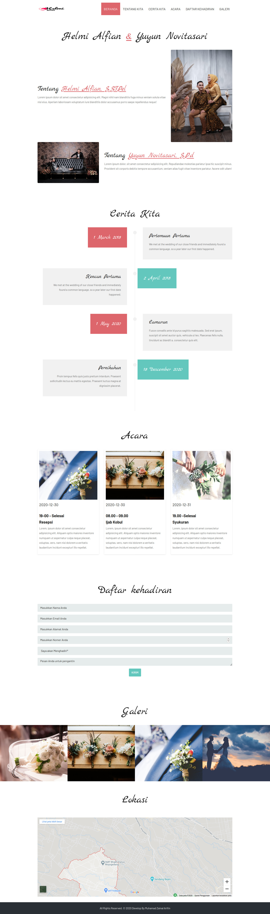
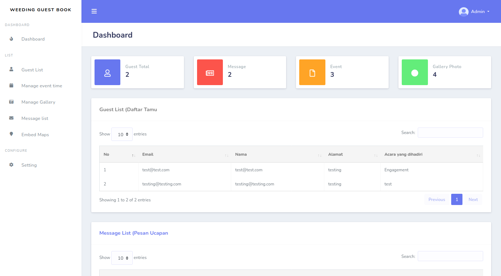

<p align="center"><a href="https://laravel.com" target="_blank"></a></p>

<h1 align="center">
  Wedding Invitation (Guest Book)
  <br>
</h1>      

# Overview




### Installation

Install the dependencies and start the server.

```sh
$ git clone git@github.com:Zainal21/The-Guest-Book-Weeding-Project.git
$ cd The-Guest-Book-Weeding-Project.
$ composer install
$ cp .env.example to .env
$ change setting for database & generate key with php artisan key:generate
$ Import .sql file to your local DBMS
$ Call Action to Migrate Database & seeder with php artisan migrate --seed (Skip this if you import .sql file manually)
$ php artisan serve
```


## The Project is MIT licensed.
----------------------------------------------
2020 © Muhamad Zainal Arifin
